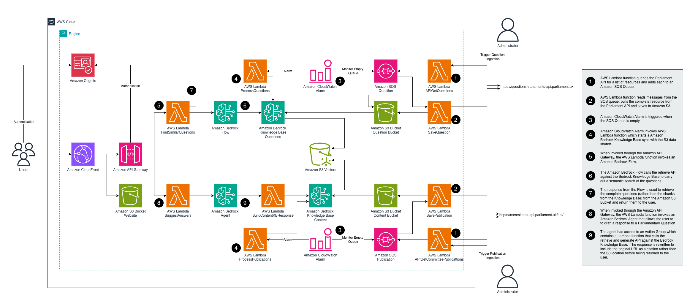

# Parliamentary Question Responder

## Description

Parliamentary Question Responder is an intelligent solution designed to streamline the process of responding to parliamentary questions (PQs) for government officials and teams. Using Amazon Bedrock's generative AI capabilities, Parliamentary Question Responder extracts data from APIs, stores it efficiently in AWS, and enables users to quickly generate accurate, policy-aligned responses to citizen inquiries, dramatically reducing the time and resources traditionally required.

## Architecture



## Prerequisites

* AWS Account
  * Current shell authenticated to your AWS Account
  * Model access granted in target region (default us-west-2) for:
    * anthropic.claude-3-sonnet-20240229-v1:0
    * amazon.titan-embed-text-v2:0
* AWS CLI
* Python 3.13
* Node v20 (configured in your terminal)
* make > v4 (`brew install make`)

## Installation

From a shell that is authenticated to your AWS Account, change directory to where you would like to clone the repo.
```
git clone https://github.com/aws-samples/sample-parliamentary-question-responder.git
cd sample-parliamentary-question-responder
gmake init
source .venv/bin/activate
gmake deploy
```
Once the sample is deployed [AWS Lambda](https://aws.amazon.com/lambda/) functions are called to pull the last 4 days of written questions and publications from the Education Committee from the Parliamentary API.  Once the content has been retrieved it is added to the appropriate [Amazon Bedrock Knowledge Bases](https://aws.amazon.com/bedrock/knowledge-bases/). This asynchronous process can take a few minutes to complete, you can track progress by looking at the length of the [Amazon Simple Queue Service](https://aws.amazon.com/sqs/) queues.

## Accessing the Application

To access the frontend website, locate the SiteCloudFrontUrl value from the stack outputs (this is also displayed as the final output of the `gmake deploy` command) and paste this URL into your browser. When the page loads, click the **Sign In** button and then select the **Create an account** link to set up your user account. 

After completing the account creation process, you can use the **Find similar questions** feature to search for previously asked questions and their responses, or use the ****Chat** feature to interact with the publications Knowledge Base and draft responses to parliamentary questions.

## Useful Commands

* `gmake init` (Install / update python and node dependencies)
* `gmake deploy` (Deploy the latest version of the backend, frontend and retrieve the last 4 days of written questions and all publications from the Education Committee to the Knowledge Bases)
* `gmake delete` (Delete the sample from your AWS Account including all data)
* `gmake deploy-backend` (Deploy the latest version of the backend)
* `gmake sync-backend` (Deploy backend changes as updates are saved)
* `gmake deploy-frontend` (Deploy the latest version of the frontend)
* `gmake run-frontend` (Run the frontend locally)
* `gmake get-questions-<number of days>` (Retrieve the last *number of days* questions to add to the Knowledge Base)
* `gmake clean` (Remove temp files from the project directory)
* `gmake unit` (Run backend unit tests)
* `gmake integration` (Run backend integration tests)